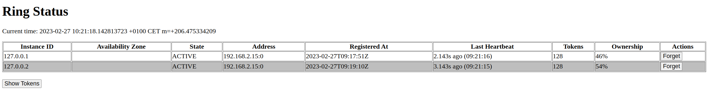
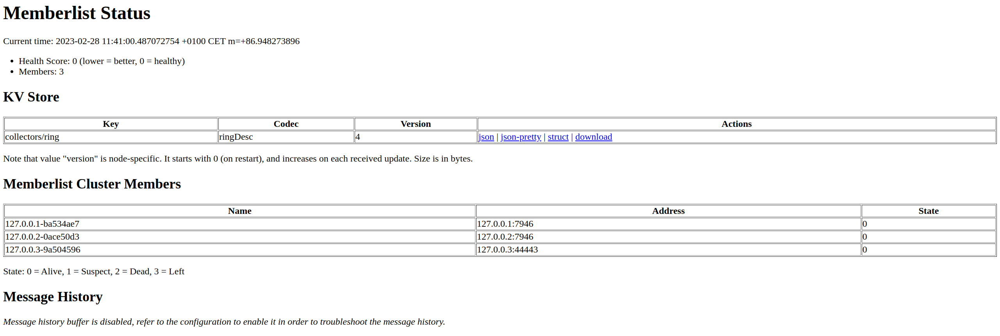

## Build local cluster using `Ring`

This examples uses `loopback` interface to build a ring of multiple processes locally.

### Usage

1. Build
```
go build local.go
```

2. Start a peer

```
./local -bindaddr=127.0.0.1
```

3. Start another peer in different terminal

```
./local -bindaddr=127.0.0.2 -join-member=127.0.0.1
```

4. You can start as many peers as you want with different loopback bindaddr.

5. Check the ring page

Go to ring page of one of the peers. Each peer's ring page should show all the peers in the ring. Should look something like below.

e.g: http://127.0.0.1:8100/ring



6. Also check the memberlist status page.

e.g: https://127.0.0.1:8100/kv



7. You can also get the `ring` information as a client.

```
./local -mode=client
```
